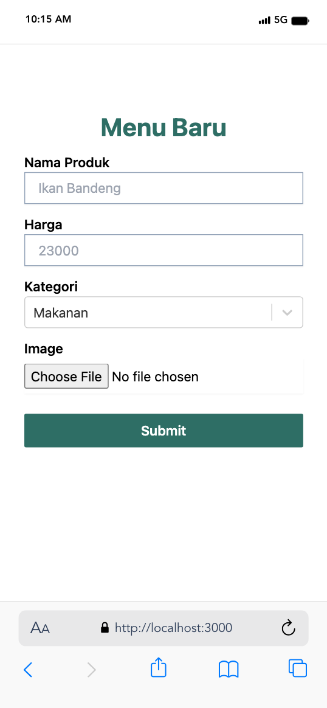

# SENDAWA

This platform aims to change the way MSMEs that eat and drink operate through the use of technology. With a focus on digitalization, this product offers a solution in the form of a web-based platform that allows MSMEs to create and manage their menus easily via QR codes. Through the use of QR, customers can quickly access the available menu by simply scanning the code

## About Our Team
- Name: Ramtech Team
- 
- Hustler : Perdi
- Hipster : Muhammad Wahyu Hidayat
- Hacker : Muhammad Fayzul Haq


## Prerequisites

Before getting started, ensure you have the following prerequisites:

- Node.js 14 or higher
- npm or yarn package manager

## Getting Started

- Install the dependencies:

```bash
  npm install
  # or
  yarn install
```

- Run the development server:

```bash
  npm run dev
  # or
  yarn dev
```

Open [http://localhost:3000](http://localhost:3000) with your browser to see the result.


## Our Progress
- 12 Jan 2024 \n

Check out our [real progess](https://sendawa.vercel.app/) for more details.





## Set Up Firebase

<https://console.firebase.google.com/>

- Log in with your Google account.
- Click on `Go to console` button.
- Click `Add Project` card.
- Give your project a name.
- Click on `Continue` button.
- Disable `Google Analytics for this project` (unless you wish to use it).
- Click `Create project` button.
- Click on the web icon button to create your web app. It will show a text popup `Web`.
- Register app by giving it a nickname and click `Register app` button.
- Where package.json is located, in your cli, type `npm i firebase`.
- Copy configuration file. Make a new file in `src` called `firebase` called `firebase.js`.
- In project root, create a file and name it `.env`.
- Make sure you add `.env.local` to your `.gitignore` so you don't expose your variables in git repo.
- Follow the instructions here at <https://nextjs.org/docs/pages/building-your-application/configuring/environment-variables#loading-environment-variables> to add your variables from firebase.js into this file.

Example...

```md
NEXT_PUBLIC_FIREBASE_API_KEY=your_api_key
NEXT_PUBLIC_FIREBASE_AUTH_DOMAIN=your_auth_domain
NEXT_PUBLIC_FIREBASE_PROJECT_ID=your_project_id
NEXT_PUBLIC_FIREBASE_STORAGE_BUCKET=your_storage_bucket
NEXT_PUBLIC_FIREBASE_MESSAGING_SENDER_ID=your_messaging_sender_id
NEXT_PUBLIC_FIREBASE_APP_ID=your_app_id
NEXT_PUBLIC_FIREBASE_MEASUREMENT_ID=
DATABASE_REALTIME=
```
## Firebase services
- Firebase Authentication
- Firebase Firestore
- Firebase Cloud Storage


## Backend Services
- 
